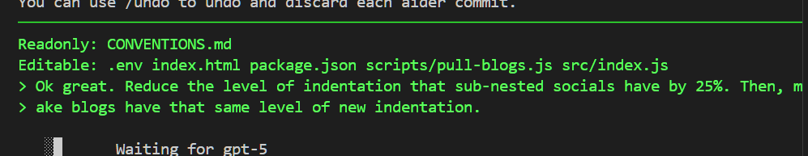

### Preamble

I'm using AI assistance for a while now but for this blog feature that I installed onto my website I decided to do it almost all entirely using aider which is an open source AI assistant. the process has been pretty good I would say either gets about 80% of things right first try with without too much prompting but in an end I think it's a mirrors the experience that a lot of developers are are having when they use these assistants I hear that claude code is the best one nowadays I personally haven't used anything besides aider because I think I just value open source technology a lot and it's really important to me that I'm not locked into I'm not in a vendor lock in situation at the whims of anthropic and being required to use their models only and being locked into their payment scheme

### My prior setup
For awhile I've been integrating AI into my workflows. It started like it probably did for everyone else, using ChatGPT via the web ui. Eventually it got annoying switching windows and I craved an experience where I could have the AI live a little closer, but still control what the AI did. You have to keep in mind that at this time the top model was GPT-4, and reasoning models hadn't hit the scene yet.

I decided to try an open source VS Code extension called *Continue*, which I've used for quite some time now and still do use. It has **lots** of issues- it is seriously buggy- but the fact that i still use it means something I think. I've found it very powerful despite all the annoying issues. Having an open source AI buddy that lets me use any model I want and being able to configure the experience to be nearly exactly the way I wanted was awesome. And having that separation between AI and my code meant a lot to me, as AI assistants at the time were terrible and got things wrong frequently, so I did NOT want AI slop code sneaking its way into the codebases I maintain both personally and at work.

My workflow was simple and pretty quick: 
1. Ask about the problem I am trying to solve. If I already know, just request edits that would be cumbersome to type out and then skip to step 3.
2. If asking, iterate until I find a solution that satisfies everything. Does it account for data races? Does this solution use the low level dynamodb client or the high level resource?
3. Review the code I get back in the chat window. Selectively apply it as it makes sense

I realized however there was still an opportunity to improve, namely step 3 could be made faster by having an assistant that knows the exact conventions of your codebase and is intelligent enough to follow them, *not write out code or comments in Spanish\*,* etc.

\* The earlier reasoning models with `aider` would spit out code or explanations in non-English languages. I think this is because reasoning models weren't rewarded for only reasoning in English, and some believe that reasoning models actually learned to think in different languages because different languages express different concepts better. 
### My experience

I heard about teammates using Claude Code and saying its the best thing ever that they've tried, so I decided to dust off `aider` and try it again.

I mean the kinds of directions you can give are very high level, which is cool in a way and makes the experience easy:
 

But I can't help but feel how BORING it is to use these things. And mind numbing. I keep pushing myself to stick with ai assistants, but they are so boring!!! You just tell it what to do and it does all the cool stuff automatically or you wait for it to get something wrong and then you roll up your sleeves and get to work.

I found myself wanting to constantly go back to my Continue flow and deep dive into random things. I wanted to write the CSS myself. I wanted to reinforce my knowledge of flex box logic. But AI assistants like aider got in the way of that. They instead lead to this inherently lazy workflow where you spam 